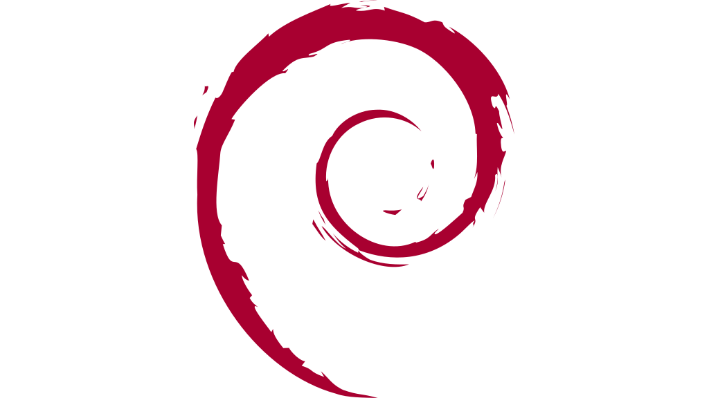

<div align="center">

<picture>
  <source media="(prefers-color-scheme: dark)">
  
</picture>

<br>

<a href="https://git.io/typing-svg">
  
</a>

<br>


<br>
<br>


&nbsp;&nbsp;


<br>

</div>


<br>

<pre align="center">
  ██████╗██╗  ██╗██╗   ██╗███╗   ██╗██╗   ██╗     ██╗██╗███╗   ██╗██████╗  █████╗  █████╗
 ██╔════╝██║  ██║██║   ██║████╗  ██║╚██╗ ██╔╝     ██║██║████╗  ██║╚════██╗██╔══██╗██╔══██╗
 ██║     ███████║██║   ██║██╔██╗ ██║ ╚████╔╝      ██║██║██╔██╗ ██║ █████╔╝╚██████║╚██████║
 ██║     ██╔══██║██║   ██║██║╚██╗██║  ╚██╔╝  ██   ██║██║██║╚██╗██║██╔═══╝  ╚═══██║ ╚═══██║
 ╚██████╗██║  ██║╚██████╔╝██║ ╚████║   ██║   ╚█████╔╝██║██║ ╚████║███████╗ █████╔╝ █████╔╝
  ╚═════╝╚═╝  ╚═╝ ╚═════╝ ╚═╝  ╚═══╝   ╚═╝    ╚════╝ ╚═╝╚═╝  ╚═══╝╚══════╝ ╚════╝  ╚════╝
</pre>

<br>

<div align="center">

## :green_circle: ABOUT

</div>

<table align="center">
<tr>
<td width="50%">

```bash
$ whoami
root@chunyujin295

$ cat /etc/motd
"Talk is cheap. Show me the code."
              — Linus Torvalds

$ uptime
24/7/365 — The grind never stops.

$ uname -a
Linux kali 6.9.0-kali #1 SMP
x86_64 GNU/Linux
```

</td>
<td width="50%">

```bash
$ tree ~/skills/
~/skills/
├── system-programming/
│   ├── C / C++
│   └── Rust
├── reverse-engineering/
│   ├── Ghidra
│   └── x86_64
├── tool-building/
│   ├── Compilers
│   └── Debuggers
└── philosophy/
    ├── Open Source
    ├── KISS Principle
    └── RTFM
```

</td>
</tr>
</table>

<br>


<br>

<div align="center">

## :wrench: THE ARSENAL

</div>

<br>

<div align="center">

| **:crossed_swords: Core** | **:toolbox: Tools** | **:brain: Knowledge** |
|:---:|:---:|:---:|
|  |  |  |
|  |  |  |
|  |  |  |
|  |  |  |
|  |  |  |

</div>

<br>


<br>

<div align="center">

## :satellite: THE DATA STREAM

</div>

<br>

<div align="center">

<p align="center">
  
  
</p>

<br>
<br>

<p align="center">
  
</p>

<br>

<picture>
  <source media="(prefers-color-scheme: dark)" srcset="https://raw.githubusercontent.com/chunyujin295/chunyujin295/output/github-contribution-grid-snake-dark.svg" />
  <source media="(prefers-color-scheme: light)" srcset="https://raw.githubusercontent.com/chunyujin295/chunyujin295/output/github-contribution-grid-snake.svg" />
  
</picture>

</div>

<br>


<br>

<div align="center">

## :pray: RESPECT

> *"If I have seen further, it is by standing on the shoulders of giants."*
> — Isaac Newton

<br>

<table align="center">
<tr>
  <td align="center" width="380" valign="top">

<a href="https://bellard.org/">
  
</a>

### Fabrice Bellard

<sub>
Creator of **FFmpeg**, **QEMU**, **Tiny C Compiler**, **Jslinux**<br>
The quiet genius who redefined what one programmer can do.
</sub>

<br>

<a href="https://bellard.org/">
  
</a>

  </td>
  <td align="center" width="380" valign="top">

<a href="https://github.com/tsoding">
  
</a>

### Alexey Kutepov <sub><i>(tsoding)</i></sub>

<sub>
Low-level programming streamer & tool builder<br>
Creator of **nob.h**, **boomer**, **pinpog**, **nothing**
</sub>

<br>

<a href="https://github.com/tsoding">
  
</a>
&nbsp;
<a href="https://twitch.tv/tsoding">
  
</a>

  </td>
</tr>
</table>

</div>

<br>


<br>

<div align="center">


<br>

<sub>01001000 01100001 01100011 01101011 00100000 01010100 01101000 01100101 00100000 01010000 01101100 01100001 01101110 01100101 01110100</sub>

</div>
